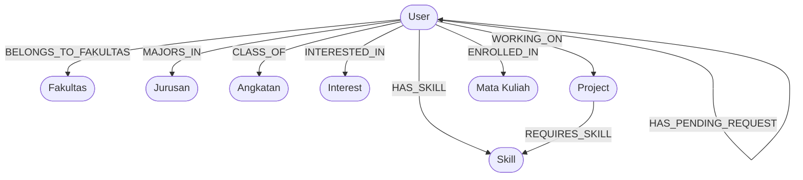

# 🎓 Study Buddy

<div align="left">

[](https://turbo.build/)
[](https://nextjs.org/)
[](https://expressjs.com/)
[](https://neo4j.com/)
[](https://nodejs.org/)
[](https://opensource.org/licenses/MIT)

</div>

An academic graph collaboration platform designed to help university students discover study partners, project collaborators, and research cohorts based on academic demographics, shared courses, skills, and learning goals. The project is structured as a high-performance monorepo using **Turborepo** and is powered by the **Neo4j Graph Database** engine.

---

## 🛠️ Tech Stack & System Architecture

| Layer | Technology | Purpose & Specifications |
| :--- | :--- | :--- |
| **Monorepo** | **Turborepo** (`turbo`) | Parallel tasks, cached pipelines, unified dependency management. |
| **Frontend** | **Next.js 16** + **TypeScript** | React 19 Client UI with elegant, Apple-inspired Human Interface guidelines (Glassmorphism design language). |
| **Backend** | **Express.js** + **Node.js** | RESTful API controller layer connected directly to Neo4j using the native `neo4j-driver`. |
| **Database** | **Neo4j AuraDB** | Cloud-native Property Graph Database for lightning-fast relation traversals and Cypher queries. |
| **Styling** | **Tailwind CSS v4** | Highly custom glassmorphism utility classes (`backdrop-blur-xl`, `bg-white/60`, custom typography). |

---

## 📊 Graph Database Schema (Neo4j)

The application utilizes a rich social graph schema to match students. Relationship links and traversals form the foundation of our recommendations engine.



### Core Cypher Node Labels
*   `User`: Student academic profile node (fields: `id`, `email`, `password` (hashed), `name`, `bio`, `profilePicture`).
*   `Fakultas` / `Jurusan`: Faculty and major tags.
*   `Angkatan`: Academic cohort year (field: `year`).
*   `Skill`: Technical/academic skill nodes (field: `name`).
*   `Interest`: Shared learning or domain interests (field: `name`).
*   `Project`: Collaborative student projects (fields: `title`, `description`, `status`).
*   `MataKuliah`: Enrolled university courses (fields: `name`, `code`).

### Relationship & Social Schema
*   `HAS_PENDING_REQUEST`: Directed connection representing a pending friendship invitation.
*   `IS_FRIENDS_WITH`: Bidirectional mutual friendship connection.

---

## 🧠 Core Search & Recommendation Algorithms

The backend contains optimized **Cypher** queries executing four key matchmaking methodologies:

1.  **Search by Academic Filters (Case-Insensitive & Dynamic)**
    *   *Mechanism*: Dynamically matches student profiles using partial, case-insensitive string filtering (`toLower` and `CONTAINS`) against linked `Fakultas`, `Jurusan`, or `Angkatan` relationships. If a filter is empty or set to "Semua", it is gracefully ignored.
2.  **Recommendations by Shared Interests (Case-Insensitive)**
    *   *Mechanism*: Computes overlapping academic interests by evaluating matching string names (case-insensitive) between nodes and sorting by interest density.
    *   *Cypher logic*: `MATCH (me:User {id: $userId})-[:INTERESTED_IN]->(myInt:Interest), (other:User)-[:INTERESTED_IN]->(otherInt:Interest) WHERE me.id <> other.id AND toLower(myInt.name) = toLower(otherInt.name) RETURN other, count(otherInt) AS mutualInterests ORDER BY mutualInterests DESC`
3.  **Mutual Skills Matchmaking (Case-Insensitive)**
    *   *Mechanism*: Identifies peer suggestions sharing mutual skillsets based on case-insensitive string matching of connected `Skill` nodes.
    *   *Cypher logic*: `MATCH (me:User {id: $userId})-[:HAS_SKILL]->(mySkill:Skill), (other:User)-[:HAS_SKILL]->(otherSkill:Skill) WHERE me.id <> other.id AND toLower(mySkill.name) = toLower(otherSkill.name) RETURN other, count(otherSkill) AS mutualSkillsCount ORDER BY mutualSkillsCount DESC`
4.  **Academic Proximity & Social Graph**
    *   *Mechanism*: Evaluates relational proximity by prioritizing mutual friends (2-degree friendship paths) combined with major/academic year overlaps.

---

## 📁 Repository Structure

```text
.
├── apps/
│   ├── frontend/         # Next.js App Router client with Tailwind CSS v4
│   └── backend/          # Express.js REST API server with Neo4j driver
├── package.json          # Root workspace dependency declarations
├── turbo.json            # Turborepo build and task execution pipeline
└── README.md             # Technical documentation
```

---

## 🚀 Getting Started

### 📋 Prerequisites
*   **Node.js**: `v20.x` or later
*   **NPM**: `v10.x` or later (or `pnpm` / `yarn`)
*   **Neo4j AuraDB**: An active AuraDB cloud instance setup with `neo4j+s` protocol

### 🔑 Environment Configuration
Create a `.env` file in `apps/backend/` and configure your credentials (see `.env.example`):


### ⚙️ Installation & Development

1.  **Clone the Repository**
    ```bash
    git clone https://github.com/kalldjo/MiniProject_StudyBuddy.git
    cd MiniProject_StudyBuddy
    ```

2.  **Install Monorepo Dependencies**
    ```bash
    npm install
    ```

3.  **Run Development Servers**
    Spins up Next.js client (`localhost:3000`) and Express server (`localhost:3001`) simultaneously:
    ```bash
    npm run dev
    ```

4.  **Build All Workspace Applications**
    ```bash
    npm run build
    ```

5.  **Lint Codebases**
    ```bash
    npm run lint
    ```

---

## 🎨 UI/UX Design System

The frontend conforms strictly to custom **Apple Human Interface Guidelines (HIG)** under a premium **Light Theme Glassmorphism** configuration:
*   **Color Palette**: Primary high-contrast slate-black typography overlaid on rich white/60 translucent backdrops.
*   **Aesthetic Details**: Heavy usage of `backdrop-blur-xl`, `border-white/40`, subtle floating drop-shadows, and smooth micro-animations.
*   **Typography**: Clean geometric typography using standard `Inter` or system sans-serif headers with tight letter tracking.