# Data Modeling: Study Buddy Graph Schema

## Structure & Entities

Our application uses a property graph model. Unlike relational tables, our data is structured into **Nodes** (entities) and **Relationships** (directed edges connecting those entities).

### Core Nodes

* **`User`**: The central entity representing a student (Properties: `id`, `name`, `email`, `bio`).
* **Academic Demographics**: `Fakultas`, `Jurusan`, `Angkatan` (Properties: `name`, `year`).
* **Learning & Capability**: `Skill`, `Interest`, `MataKuliah` (Properties: `name`, `code`).
* **Collaboration Entities**: `Project`, `Opportunity`, `Post` (Properties: `title`, `content`, `createdAt`).

### Key Relationships

Relationships define the semantic context of the connections:

* **Academic Profile**: `(User)-[:BELONGS_TO_FAKULTAS]->(Fakultas)`
* **Social Context**: `(User)-[:IS_FRIENDS_WITH]->(User)`
* **Skill & Interest Matching**: `(User)-[:HAS_SKILL]->(Skill)` and `(User)-[:INTERESTED_IN]->(Interest)`
* **Project Collaboration**: `(User)-[:CREATED_PROJECT]->(Project)` and `(Project)-[:USES_SKILL]->(Skill)`

---

## Detailed Data Model Diagram

```mermaid
graph TD
    User([User])
    Fakultas([Fakultas])
    Jurusan([Jurusan])
    Angkatan([Angkatan])
    Skill([Skill])
    Interest([Interest])
    MataKuliah([Mata Kuliah])
    Project([Project])
    Message([Message])
    Flashcard([Flashcard])
    CourseGrade([Course Grade])
    Notification([Notification])
    Opportunity([Opportunity])
    Post([Post])
    Certificate([Certificate])

    User -->|BELONGS_TO_FAKULTAS| Fakultas
    User -->|MAJORS_IN| Jurusan
    User -->|CLASS_OF| Angkatan
    User -->|HAS_SKILL| Skill
    User -->|INTERESTED_IN| Interest
    User -->|ENROLLED_IN| MataKuliah
    
    User -->|IS_FRIENDS_WITH| User
    User -->|HAS_PENDING_REQUEST| User
    
    User -->|CREATED_PROJECT| Project
    User -->|JOINED_PROJECT| Project
    User -->|HAS_PENDING_JOIN_REQUEST| Project
    Project -->|USES_SKILL| Skill
    
    User -->|SENT_MESSAGE| Message
    Message -->|DELIVERED_TO| User
    
    User -->|CREATED_FLASHCARD| Flashcard
    User -->|TRACKS_GRADE| CourseGrade
    User -->|HAS_NOTIFICATION| Notification
    
    User -->|POSTED_OPPORTUNITY| Opportunity
    User -->|APPLIED_FOR| Opportunity
    
    User -->|POSTED| Post
    User -->|LIKED| Post
    User -->|COMMENTED| Post
    
    User -->|EARNED_CERTIFICATE| Certificate
```



---

## Why it Fits the Graph Paradigm?

The Study Buddy recommendation engine relies heavily on finding overlaps. For instance, to recommend a study partner based on shared interests, the system executes a Cypher query to find a path like:

```cypher
(User A)-[:INTERESTED_IN]->(Interest)<-[:INTERESTED_IN]-(User B)
```

This paradigm fits perfectly because our primary query pattern is **traversing relationships** rather than aggregating disparate tables. It makes implementing mutual skill matchmaking and academic proximity highly performant and extremely easy to scale.
